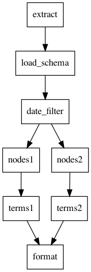

# Terms of Interest - Design Doc

## Components
* Data processing pipeline (DAG)
* Operator nodes that perform the steps of load, deserialization, filtering, and formatting output.
* Tokenizing text into word streams.
* Data schemas for enforcing data integrity, coercing types, etc.
* Matchers for usersets and termsets.
* CLI Machinery.

## Visuals
### Pipeline DAG


### Aho-Corasick Automatons
* [terms1.txt](terms1.gv.pdf)
* [terms2.txt](terms1.gv.pdf)

## Constraints
* Termsets have an upper bounds constraint of: 15,000 individual words + 15,000 bigrams = 30,000.
* Usersets have an upper bounds constraint of: 15,000 node_ids.
* Tweets have a text field comprising of 140 characters, or roughly 30 words.
* Number of tweets have an upper bounds of 3600*15000 per unit x 2 units = 108,000,000.

## Takeaways:
* 108,000,000 tweets would be too big to fit in memory, tweets should be read one line at a time from disk.
* Termset and userset data structures are small enough to fit in memory.
* Usersets should optimize for testing user membership, use a set with O(1) lookups.
* Termsets should optimize for needles in haystack type query. Use a PrefixTrie-like data structure that optimizes the prefix lookups with fast suffix transitions on failover.
* An optimal data structure for termsets is the Aho-Corasick Automaton, since it provides a consistent linear runtime performance in relation to the number of words in the haystack, regardless of how many terms (needles) are being searched for, and without backtracking.

### Termset data-tructure complexity analysis:
#### List (Naive)
```
n = number of terms
m = number of ngrams in terms
q = number of ngrams in query text (haystack)
r = number of results returned

Build:
  Time: O(n + m)
  Space: O(n + m)

Query:
  Time: O(qm)
  Space: O(r)
```

Can we do better?

#### Set
```
n = number of terms
m = number of ngrams in terms
q = number of ngrams in query text (haystack)
r = number of results returned

Build:
  Time: O(n + m)
  Space: O(n + m)

Query:
  Time: O(q)
  Space: O(q + r)
```

Can we do better?

#### Trie
```
Since matches exist only on word boundaries, each node only stores a
complete word rather than a single character.

n = number of terms
m = number of nodes in trie (roughly equal to total number of words in terms)
w = number of words in query text (haystack)
r = number of results returned

Build:
  Time: O(n)
  Space: O(n + m)

Query:
  Time: O(w) Best Case, worse with increased backtracking
  Space: O(w + r)
```

Can we do better?

#### Aho-Corasick Automaton
```
Since matches exist only on word boundaries, each node only stores a
complete word rather than a single character.

Since search terms can be prefixes and suffixes of other terms, fast fail transitions would be a great optimization technique.  The resulting query algorithm would never have to backtrack and performance of the algorithm would be the same, with 30 terms or 300,000 terms!

n = number of terms
m = number of nodes in automaton (roughly equal to total number of words in terms)
w = number of words in query text (haystack)
r = number of results returned

Build:
  Time: O(n + m)
  Space: O(n + m)

Query:
  Time: O(w) Best & Worst Case
  Space: O(r)
```

## Answers to Take-home questions
**Q1. Storage Design**
* a. How/where would you store these matches?  If you would use some kind of database, what would the schema look like?
* b. Let’s assume we want to access the results by date of occurrence and node_id. How will your storage design accommodate this access pattern?

A. It depends on alot of things really.  The matches themselves are two member tuples in a format ready to be parsed as a CSV file.  In some cases uploading that to s3 with some metadata about the job may be enough.  I can also see a case for storing them in a Postgres table or InfluxDB.

The library that I use for the pipeline (glide) has a pre-defined operator node for loading results into a SQL database that could be a drop-in replacement or work alongside the existing node that prints the results to stdout.  I think the following tabble schema would adequate: `term: str, message_id: int`, using indexes on columns frequently appearing in WHERE, ORDER BY, GROUP BY statements.

B. I would probably use a similar schema, adding those two fields: `term: str, message_id: int, date: date, node_id: int`, with indexes on date and node_id.  I would probably have a discussion about the effects of converting a UTC datetime to dates since you would lose the ability to convert to local timezone at a later date.  Dates may be off by one day in some cases.

**Q2. How would you handle monitoring and alerting to let you know if the job fails?**

I would probably something like Apache Airflow to schedule this workflow, and integrate with a monitoring and alerting platform like DataDog.  If this would run in a Kubernetes cluster, the integration could be done with a datadog sidecar pod. If the cluster was equipped with Prometheus, that would be another good option.  Alerts could be sent via email, SMS, or Slack.


**Q3. How would you design an API to update the terms and users lists?**

Given the following information:
  * Termsets could be updated daily, node sets would not change.
  * New units (termsets and nodesets) may be initialized, and thereafter the terms may change daily.
  * Terms change in place.  Task is forward moving only, not retroactive.

I would envision a versioned REST API with the following resource heirarchy:
```
api.example.com
  /v1
    /pipelines/
      /terms_of_interest
        /units
          /{unit_id}
            /terms
```

**Resource Schemas:**

```graphql
type Unit(
  id: ID!
  name: String
  userset: [String]
  termset: Termset
)

type Termset(
  terms: [String]
)
```

**Example Payloads & Returns:**

GET /v1/pipelines/terms_of_interest/units

Status: 200

Response Data:
```json
{
  "data": [
    {"name": "group1"},
    ...
  ]
}
```

GET /v1/pipelines/terms_of_interest/units/{unit_id}

Status: 200

Response Data:
```json
{
  "data": {
    "name": "group1",
    "userset": ["23423423", ...],
    "termset": ["term entry", "entry", ...]
  }
}
```

POST /v1/pipelines/terms_of_interest/units

Request Data:
```json
{
  "name": "group1",
  "userset": ["23423423", ...],
  "termset": ["term entry", "entry", ...]
}
```
Status: 204


DELETE /v1/pipelines/terms_of_interest/units/{unit_id}

Status: 204


GET /v1/pipelines/terms_of_interest/units/{unit_id}/terms

Status: 200

Response Data:
```json
{
  "data": [
    "term entry",
    "entry",
    ...
  ]
}
```


PUT /v1/pipelines/terms_of_interest/units/{unit_id}/terms

Request Data:
```json
{
  "termset": ["new term entry", "entry", ...]
}
```
Status 204


**Q4. How would this solution scale if you were receiving many gigabytes worth of tweets per day?**

It would scale quite well IMO.  Usersets are stored in set data structures with O(1) lookups.  Termsets are stored in Trie-like Aho-Corasick Automatons, with linear O(w) lookups, where w = number of words in each tweet.  Since tweet text can be assumed to only contain 140 characters, or roughly 30 words, and that remains constant, you can instead focus only on number of tweets. Using Aho-Corasick should achieve a consistant linear runtime of O(n) where n = number of tweets.

To validate these assumptions, I turn to a quick and dirty benchmarking tool, accessible through the CLI as `toi benchmark`, to run some simulations using Aho-Corasick.  I used the text of moby dick to build worst case termsets using a seed of 30,000 terms, then used the same text broken up into strings containing 30 words each.  The result was a termset containing 102,074 ngrams, and roughly 7067 simulated tweets containing approximately 1MB of text.  I ran these benchmarks 1000 times to simulate a run of ~2GB worth of tweets, with roughly 1GB of that being tweet text.

```bash
$ toi benchmark \
    --algos "Naive Set,Trie,Aho-Corasick" \
    --fileid melville-moby_dick.txt \
    --top-ngrams 30000 --runs 1000
```

Here are the results:
```
Ngrams: 102074
Sentences: 7067
Words/sentence: 30
Runs: 1000

          NAME  TOTAL TIME  AVERAGE TIME  MEMORY

     Naive Set   442.4442s       0.4424s  11007k
          Trie   293.2420s       0.2932s  66054k
  Aho-Corasick   189.4825s       0.1895s  43057k
```

The performance of Aho-Corasick is certainly promising, especially in regards to the set and trie implementations.  This simulation did not include the Naive List implementation for reasons of sanity.

2GB worth of tweets in 3 minutes isn't bad, but we could do better.  While we're already using the most optimal data structures and algorithms, we're hitting a bottleneck in the python GIL that's preventing us from utilizing more than one core.  There is room for a possible 4x (+/-) improvement per node, which can further be distributed across multiple compute nodes.  I unfortunately ran out of time before getting to that point, but the pipeline library I used `glide` has out of box support for Dask, Celery, etc.  In cases where the data is historical, we could also partition the dataset by day.

